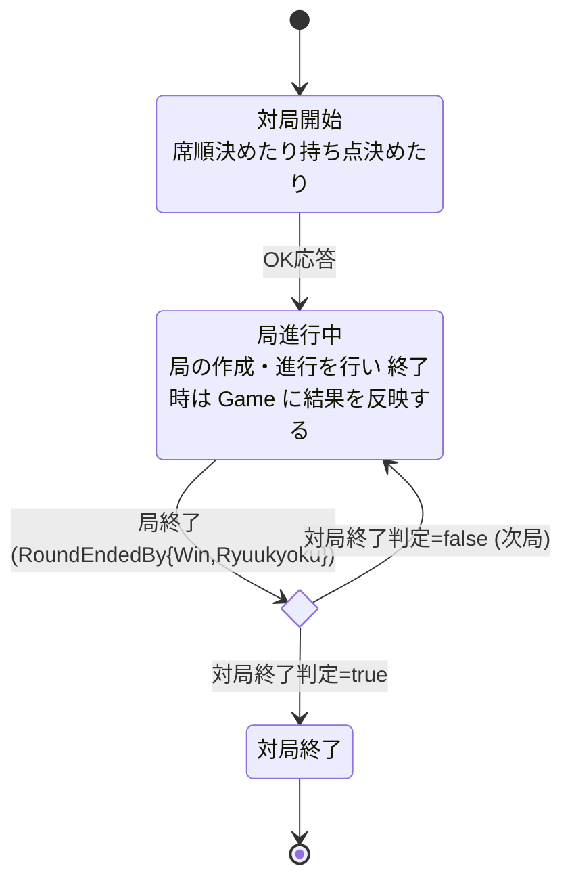
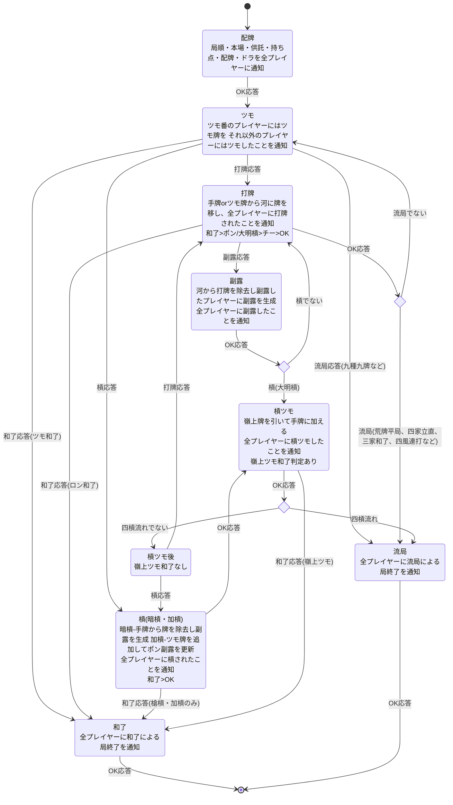

# 設計

## モジュール構成

- **Mahjong.Lib.Scoring** — 点数計算専用ドメイン。`TileKind`(0-33、34種の絵柄)のみを扱う
- **Mahjong.Lib.Game** — 対局進行専用ドメイン。`Tile`(0-135、136枚を個別識別)を扱う
- 両ライブラリは相互参照しない。対局中に点数計算へ渡す際は `Tile.Kind`（= `Id / 4`）で牌種インデックスへ変換する
- 点数計算では同種牌を区別する必要がないため `TileKind` のみで十分だが、対局では赤ドラなど同種牌の個別識別が必要なため `Tile` を使う

## 設計方針

- ドメインモデルはすべて `record` + `ImmutableList` / `ImmutableArray` のイミュータブル設計。状態更新は常に新インスタンスを返す
- 局全体の状態は `Round` record に集約する。進行アクション（配牌/ツモ/打牌/副露/槓/etc.）はすべて新しい `Round` を返す
- 4プレイヤー分の状態は `HandArray` / `RiverArray` / `CallListArray` / `PointArray` といったプレイヤー別配列型に統一し、`PlayerIndex` でアクセスする
- 局の状態遷移は `System.Threading.Channels.Channel<T>` を使った非同期イベント駆動のステートマシンで実装する

## 牌

- 牌は牌(Tile)と牌種別(TileKind)に分ける
- 牌種別は牌の絵柄を表現する
  - 点数計算には牌の絵柄のみが必要なので
- 牌は同じ絵柄でも牌1枚1枚を区別して表現する
  - 実際のゲームでは牌を区別する必要があるので
- 赤ドラはルールによって異なるため、局ごとに管理し点数計算モジュールや表示モジュールに通知する

## 副露種類

- ポン
- チー
- 暗槓
- 大明槓
- 加槓
- 点数計算において大明槓と加槓には差がないため明槓にまとめる
- 対局において大明槓と加槓は表示上の違いがあるため区別する

## 点数計算

- 役と点数は天鳳準拠
- ルールは天鳳準拠だがローカルルールも多少込み

## 対局の状態遷移



Phase 1 では「局終了」を表す独立状態は持たず、局終了時の Game 更新・終了判定・次局決定は `GameStateRoundRunning.RoundEndedBy*` ハンドラ内で行い、直接 `GameStateRoundRunning`(次局)または `GameStateEnd` へ遷移する。Phase 5 のプレイヤー向け局終了通知実装時に必要なら `GameStateRoundEnd` 状態を再導入する。

### RoundWind の循環仕様

`Game.AdvanceToNextRound` で `RoundNumber` が 3 を超える場合、`RoundWind` は東→南→西→北→東 と循環する仕様。通常ルールでは `GameEndPolicy` により規定局数消化時点で対局終了するため循環には到達しないが、対局形式を超えて続行するテストシナリオや、将来の西入/北入ルール実装(Phase 以降で検討)に備えた定義。

## 局の状態遷移



- プレイヤーに通知後、全プレイヤーの応答を待つ
- 副露のチー・ポン・大明槓のそれぞれの処理はCallで行う
- 立直は打牌と統合する
  - 立直打牌に対して和了応答があった場合は供託しない
  - 立直打牌に対して和了応答がなかった場合は供託後、打牌に対する応答の処理を行う
- チーとポン/大明槓が同時にあった場合はポン/大明槓が優先
- 副露とロンが同時に合った場合はロンが優先
- ダブロン、トリプルロンはルールによる(天鳳ではダブロンあり、三家和了は途中流局。天鳳以外のルールへの対応も視野に入れている)
- 同時副露や同時ロンは図に書くと複雑すぎるので省略 集約したのち優先順位に従って遷移させる実装を行う
- 槓など複数のイベントでの遷移先があるものも同様に集約後優先順位に従って遷移させる実装を行う
- 槓ドラ表示タイミング: 天鳳では暗槓は即乗り、明槓/加槓は後めくり(打牌または続く嶺上の直前)
- 四槓流れは槓ツモ後和了でない場合に判定が行われる
- 抜きは一旦考えないが、点数計算ライブラリではあらかじめ考慮しておく

## 要素

対局に出てくる要素は以下

- プレイヤー
- 親
- 持ち点
- 山
  - ドラ表示牌
  - 裏ドラ表示牌
  - 嶺上牌
- 河
- 手牌・副露
- 局順 東一局とか
- 本場
- 供託(リーチ棒)
- ツモ番
- ルール
  - 赤が何枚かなども

## プレイヤー

- プレイヤーはAIと人間両方に対応する
- プレイヤーは抽象型を用意し、それぞれをAIと人間用で継承して使用する
- 通知は各プレイヤーに対して処理後の状態を通知し、全プレイヤーの応答が揃うのを待つ
- 通知にはユニークなIdを振り、応答にもそのIdを含めることで待機中のものと一致していることを確認する
- 通知の種類によっては不適格な応答種類もあるため検証が必要
- 全ての応答がそろったら優先順位に従って最も処理をする
- AIの場合は同一プロセス内で応答を待つかも知れないが、人間の場合は別プロセスクライアントの可能性が高いのでその辺りも考慮した待ち方にする

### プレイヤー側の階層構造

参考: 書籍『麻雀AI』(電脳麻将)のMajiang.Player階層。AIとUIプレイヤーを共通の抽象基底の派生として実装し、階層ごとに責務を切る。ただし書籍の「行動提示層」はプレイヤー側ではなく対局側(通知送信側)に置く。

| 層                 | 責務                                                          | Player基底 | AIプレイヤー | 人間プレイヤー |
| ------------------ | ------------------------------------------------------------- | ---------- | ------------ | -------------- |
| 1. 通知受信層      | ゲームからの通知を受信し、種別ごとに振り分け                  | ●          |              |                |
| 2. 状態管理層      | 自プレイヤー視点の卓情報を更新                                | ●          |              |                |
| 3. 応答決定層      | 通知に含まれる合法行動候補から1つ選び、ゲームへ応答送信       |            | ●            | ●              |
| 4. 思考ルーチン層  | 候補から行動を選択(AIのみ)。人間プレイヤーはUI入力で代替      |            | ●            |                |

- 第1層の入口は書籍では `action()` 単一メソッドだが、本プロジェクトでは通知種別ごとのメソッド(`OnHaipai` / `OnTsumo` / `OnDahai` / `OnCall` / `OnKan` / ...)に分割する。単一入口の`switch`肥大化を避けるため
- 第2層で保持する卓情報は「自分視点に射影済みの状態」。他家の手牌や山の中身など見えない情報は含めない
- **書籍との差分**: 書籍では第5層「行動提示層」(合法行動列挙)が `Majiang.Player` 基底に存在するが、本設計では対局側の責務とする(下記「行動提示はサーバー側責務」参照)

### 行動提示はサーバー側責務

合法行動の列挙はドメインルール依存のため、対局側(通知送信側)で一元的に生成し、通知(`PlayerNotification.Candidates`)に含めてプレイヤーへ渡す。

- **理由**:
  - プレイヤー側に持たせるとルール判定ロジックがサーバー/クライアント二重実装になり、判定ズレのリスクがある
  - 不正クライアント対策として、どのみちサーバー側で応答の合法性を再検証する必要がある
  - AI の思考ルーチンは「候補から選ぶ」ことに集中でき、実装がシンプルになる
- **実装位置**: `RoundStateContext` が `RoundInquirySpec` と現在の `Round` から、`IResponseCandidateEnumerator` に候補生成を委譲する。`Mahjong.Lib.Scoring` のシャンテン判定や役判定を流用できる場面もあるが、Lib.Game 側で独自にラップする(ライブラリ間の直接依存は避ける)
- **プレイヤー側の責務**: 候補の中から1つを選んで応答するだけ。候補を自前で再計算しない

### 対局(Game)レベル

局(Round)の上位である半荘/対局全体の状態遷移は、`Round`と同様の構成で管理する。実装は`Game`系を先行させ、その後`Round*`系の通信・集約レイヤーを追加する(実装順は末尾「実装段階」参照)。

- `Game` (record, immutable) — 対局全体の状態を直接フィールドで保持(`PlayerList` / `GameRules` / `RoundWind` / `RoundNumber` / `Honba` / `KyoutakuRiichiCount` / `PointArray`)。`GameConfig` のような中間コンテナは作らない(局順など対局中に変動する値と固定パラメータを同じrecordに混在させないため)
- `Player` (abstract record) — プレイヤーの共通基底。`PlayerId` / `DisplayName` を持つ。Phase 4 で通知・応答メソッドを追加し、AI / 人間の実装が継承する
- `PlayerList` (record) — 4人分の `Player` を `ImmutableArray<Player>` で保持するラッパーで `IEnumerable<Player>` を実装。`PlayerIndex`でアクセス。**index 0 が起家**という仕様。起家決定・並び替えは呼び出し側の責務(既存 `RoundNumber.ToDealer()` が `PlayerIndex(Value)` を返す前提と整合)。`Player` 実体そのものが `PlayerList` の要素であり、識別情報と実体を二重管理しない
- `GameState` / `GameStateContext` — `Round*`と同じ非同期イベント駆動ステートマシン。状態は`GameStateInit` / `GameStateRoundRunning` / `GameStateEnd` (既存 `RoundStateXxx` の命名規約に揃える)。局終了後の Game 更新・終了判定・次局決定は `GameStateRoundRunning.RoundEndedBy*` ハンドラ内で行い 直接 `GameStateRoundRunning`(次局)または `GameStateEnd` へ Transit する。プレイヤー向けの局終了通知(Phase 5)の実装時に必要なら `GameStateRoundEnd` 状態を再導入する
- `GameManager` — 対局レベルの統括役。対局開始処理、局間の引き継ぎ、対局終了判定を統括し、各局の `RoundStateContext` を内部で生成・破棄する(親子関係)。コンストラクタで `PlayerList`(index 0 が起家になるよう並び替え済み)+ `GameRules` + `IWallGenerator` を受け取る
- **局終了時の引き継ぎ**: `GameStateContext`は`RoundStateContext`を内部保持し、`GameStateRoundRunning.RoundEndedBy*` ハンドラ内で `RoundStateContext.Round` から持ち点・本場・供託等を読み取って`Game`に反映した上で破棄、続行なら次局用に新しい`RoundStateContext`を生成する
- **局終了結果の保持場所**: 独立した `RoundResult` record は作らず、局終了イベント (`GameEventRoundEndedByWin` / `GameEventRoundEndedByRyuukyoku`) のフィールドとして結果情報を保持する(和了者 / 放銃者 / 和了種別 / 流局種別 / 連荘判定フラグ / 本場加算フラグ)。**`Round` record は変更しない**。Phase 2-3 でフィールドを拡張して役/符/翻/点数などを追加
- **Gameレベルのプレイヤー通知**: 対局開始(`PlayerList`/持ち点/ルール)、局開始、局終了(結果)、対局終了を各プレイヤーへ通知する。`Player`メソッド名は`OnGameStartAsync` / `OnRoundStartAsync` / `OnRoundEndAsync` / `OnGameEndAsync`。局内の通知は`OnHaipaiAsync` / `OnTsumoAsync` / `OnDahaiAsync` / `OnCallAsync` / `OnKanAsync` / `OnKanTsumoAsync` / `OnWinAsync` / `OnRyuukyokuAsync` / `OnDoraRevealAsync`(カンドラ表示)
- **応答型の設計**: 各`On***Async`の戻り値は通知ごとに異なる型(`Task<OkResponse>` / `Task<AfterTsumoResponse>` / `Task<PlayerResponse>` 等)にする。通知時に取りうる応答が型で制約され、不正応答の多くをコンパイル時に弾ける
- **スルー (パス) 応答の統一**: 打牌/加槓通知に対するスルーは `OkResponse` を返す。これにより全通知でスルー応答の型が一貫し、Player 実装・Wire 変換 (`OkResponseBody`)・既定応答生成 (`DefaultResponseFactory`) が簡潔になる。`AfterDahaiResponse` / `AfterKanResponse` は**アクション応答のみ**の階層 (チー/ポン/大明槓/ロン / 槍槓ロン) とし、`Player.OnDahaiAsync` / `OnKanAsync` の戻り値型は `Task<PlayerResponse>` とする (スルー時は `OkResponse`、アクション時は `AfterDahaiResponse` / `AfterKanResponse` 派生を返す)
- **`GameRules`の責務**: 対局前に決まっている**ルール**(対局形式 東風戦/東南戦(デフォルト東南)/ 赤ドラ枚数 / 初期持ち点(当面35000) / オーラス親あがり止め / トビ終了点 / 食いタン / 後付け / 連荘条件 等)。起家 / タイムアウト等の対局固有パラメータは `GameManager` コンストラクタ引数または `GameRules` 内で管理する
- **ルール設定**: `Mahjong.Lib.Game` 独自に仮の`GameRules`(仮称、名前要検討)を定義。当面は`Mahjong.Lib.Scoring.GameRules`を模した最小構成で良い。将来的に両者の変換/共通化を検討
- **対局終了条件**: オーラス親あがり止め / トビ終了 / 西入 等は`GameRules`に持たせ、`GameEndPolicy.ShouldEndAfterRound`が`GameStateRoundRunning.RoundEndedBy*`から判定される(`AdvanceToNextRound` の**前**に評価することで、終了時の `Game` が「次局予定状態」ではなく「終了した局を保持した状態」となる)

### 対局側の責務分離

対局側は既存のステートマシン(`RoundStateContext` / `RoundState`)に加え、プレイヤーとの通信・集約レイヤーを分離する。

| コンポーネント             | 責務                                                                 |
| -------------------------- | -------------------------------------------------------------------- |
| `RoundState`               | 局面の問い合わせ仕様(`RoundInquirySpec`)を返し、採用結果を受けて次状態・次`Round`を決める。プレイヤー・通信・タイムアウトは知らない |
| `RoundStateContext`        | 局進行コンテキスト (partial 3 分割: 本体 / `Runtime` / `PlayerIo`)。状態機械 (`eventChannel_` + `Transit`) と通知・応答集約ループ (`StartAsync` / `stateChannel_` / `ProcessRuntimeAsync`) を 1 クラスに統合。通知Id発行、プレイヤー視点への射影、通知送信、応答収集、検証、タイムアウトフォールバック、優先順位適用、フリテン検出、採用応答ディスパッチをすべて内部で完結させる |
| `IResponsePriorityPolicy`  | 同時応答の優先順位決定(ロン > ポン/大明槓 > チー > OK、ダブロン/トリプルロン、席順優先 等)            |
| `IRoundViewProjector`      | `Round`からプレイヤー別の公開情報ビュー(`PlayerRoundView`)を生成。情報非対称性をここに閉じ込める     |
| `IDefaultResponseFactory`  | 通知種別ごとのタイムアウト既定応答(打牌タイムアウト→ツモ切り、副露可否タイムアウト→OK 等)。プレイヤー例外時のフォールバックにも使用 |
| `Player` / `Player`   | プレイヤー抽象(interface) + 共通実装を持つ抽象基底クラス。通知メソッドは**種別ごと**(`OnHaipaiAsync`/`OnTsumoAsync`/`OnDahaiAsync`/`OnCallAsync`/`OnKanAsync`/...)に分割。`Player`は視点卓情報の更新など共通処理を持つ。`Player`自身は`PlayerIndex`を保持せず、`GameManager`が`ImmutableArray<Player>`として`PlayerIndex`→`Player`実体の対応表を保持する |
| `IGameTracer`              | 構造化イベント記録。**全イベント**(対局/局/配牌/ツモ/打牌/副露/槓/カンドラ/和了/流局/通知送信/応答受信/採用結果等)をトレース可能にし、牌譜・リプレイが再生成できるレベルを目指す。スコープは複数対局を跨ぐグローバル。統計集計は実装側で必要イベントを抽出。差し替え可能(no-op/メモリ/ファイル/DB 等) |

- State は「この局面で何を聞くか」の仕様(`RoundInquirySpec`)だけ返し、通信待ちは持たない。`Entry`/`Exit`は同期のまま保つ
- `RoundStateContext` が仕様を受け取り、`IRoundViewProjector` で視点フィルタ、各プレイヤーへ送信、集約、検証、優先順位適用を行い、採用済み結果(`AdoptedRoundAction`)を内部の `eventChannel_` 経由で次状態へ渡す
- 公開 API は **`ctor` (full-deps 9 引数) と `StartAsync(round, ct)` の 2 つのみ**。`State` / `Round` は `internal set` で同 assembly (RoundState 実装と tests assembly) からのみ書換可。`Response*Async` 6 個はすべて `private` で外部からの状態駆動経路は物理的に封鎖されている (race の構造的除去)

#### 統一通知フロー

全通知 (配牌/ツモ/打牌/副露/槓/嶺上ツモ/嶺上ツモ後/和了/流局) は `RoundState.CreateInquirySpec` 起点の**単一パイプライン**に乗せる。通知自体は常に全プレイヤーへ届き、問い合わせ対象は `RoundInquirySpec.InquiredPlayerIndices` で明示する。手番プレイヤー固有の私的情報 (ツモ牌 / 嶺上ツモ牌) は `OtherPlayerTsumoNotification` / `OtherPlayerKanTsumoNotification` で他家と遮断する。

詳細 (パイプライン全体像 / フェーズ別 `RoundInquirySpec` / 通知マッピング / `DispatchAsync` 分岐 / 候補検証規約 / 優先順位解決 / 既定応答 / `SnapshotRound` の必要性 / 撤去された旧設計) は [RoundNotificationPipeline.md](RoundNotificationPipeline.md) を参照。

### 通知・応答モデル

```
PlayerNotification
  - NotificationId        : Guid ユニークId
  - RoundRevision         : 局内連番 (古い応答の検出・リプレイ用)
  - Recipient             : PlayerIndex 通知先
  - View                  : PlayerRoundView 視点フィルタ済み卓情報
  - Candidates            : ResponseCandidate[] 合法応答候補(OKのみの場面もある)
  - Timeout               : TimeSpan タイムアウト

PlayerResponse
  - NotificationId        : 対応する通知Id
  - RoundRevision         : 対応する局Revision
  - PlayerIndex           : 応答者 (なりすまし防止のため必須)
  - Body                  : 応答内容 (OK / Dahai / Call / Kan / Win / Ryuukyoku)
```

- `ResponseCandidate` は「応答として選べる行動」を列挙する(例: 打牌後に他家が取りうる`OkCandidate` / `RonCandidate` / `ChiCandidate(handTiles)` / `PonCandidate(handTiles)` / `DaiminkanCandidate(handTiles)`)。クライアントは候補から選ぶだけでよい
- **応答はサーバー側で必ず再検証する**。候補の提示はUX/ショートカット用であり、信用してはいけない

#### C# API と Wire DTO の二層構造

プレイヤー通知/応答は **C# API 層** (`Player`) と **Wire DTO 層** (`PlayerNotification` / `PlayerResponse`) の二層で扱う。

- **C# API 層**: `Player.OnTsumoAsync(TsumoNotification) : Task<AfterTsumoResponse>` のように、通知ごとに**戻り値型を専用にする**。コンパイル時の型安全を優先
- **Wire DTO 層**: 別プロセス/別マシンとやりとりする場合に備え、`PlayerNotification` / `PlayerResponse` (Body は discriminated union 相当) を共通 envelope として定義。シリアライズ/通信基盤はこちらを使う
- **変換**: `Player` (または adapter) が C# API 層と Wire DTO 層を相互変換する。ローカル AI プレイヤーは C# API 層で直接呼び出し、別プロセスクライアントは Wire DTO 層経由

### 応答検証の3段階

1. **通信整合性検証**: `NotificationId`と`RoundRevision`が現在待機中のものと一致するか、応答元`PlayerIndex`が通知先と一致するか
2. **応答種別検証**: その通知で許可された種別か、OK以外を返してよいプレイヤーか(例: 打牌応答は手番プレイヤーのみ)
3. **ドメイン検証**: 手牌に指定牌があるか、チーは上家打牌に対してか、槓できる山残数があるか、和了条件を満たすか

`RoundEvent`のコンストラクタでは形状レベルの検証のみ行う。`Round`に依存する合法性検証は`RoundStateContext`の通知・応答集約ループ側で`Round`とともに行う。

### 採用済み応答 (AdoptedRoundAction)

プレイヤーからの生応答(`PlayerResponse`)と、ルール適用後の採用結果(`AdoptedRoundAction`)は型を分ける。採用結果型は `Mahjong.Lib.Game.Adoptions` 名前空間に配置する (入力側の `Mahjong.Lib.Game.Inquiries` と対になる出力側)。

```
AdoptedRoundAction (abstract)
  ├ AdoptedOkAction
  ├ AdoptedDahaiAction(Tile)
  ├ AdoptedAnkanAction(Tile) / AdoptedKakanAction(Tile)   // 槓 (暗槓/加槓)
  ├ AdoptedCallAction(PlayerIndex, CallType, Tile[])      // Chi/Pon/Daiminkan
  ├ AdoptedWinAction                                      // ダブロン/トリプルロン対応
  │   {
  │     Winners             : AdoptedWinner[]   // 和了者(複数可)
  │     Loser               : PlayerIndex?      // ロン時の放銃者。ツモ時は null
  │     WinType             : Ron | Tsumo | Chankan | Rinshan
  │     KyoutakuDistribution: ...               // 供託棒の配分ルール(上家取り等)
  │     HonbaDistribution   : ...               // 本場の配分
  │     DealerContinues     : bool              // 親続行判定(連荘可否)
  │   }
  │   AdoptedWinner { PlayerIndex, WinTile, Yaku[], Fu, Han, Score }
  └ AdoptedRyuukyokuAction(RyuukyokuType)
```

- ロンは複数採用され得るため`Winners`は配列。各和了者ごとに`AdoptedWinner`でスコア情報(役/符/翻/点数)を保持
- ダブロン時の供託は**上家取り**、本場は放銃者が全和了者に支払う(天鳳準拠)。これらは`KyoutakuDistribution` / `HonbaDistribution` で表現
- 流局は種別(`SanchaHou` / `Suukaikan` / `Suufonrenda` / `SuuchaRiichi` / `KouhaiHeikyoku` / `KyuushuKyuuhai` 等)を持つ
- 三家和了は「採用しない(流局扱い)」ルールを採る場合、`AdoptedWinAction` ではなく `AdoptedRyuukyokuAction(SanchaHou)` に落とす

### 通知と応答

通知は対象プレイヤー全員へ送り、全員からの応答を待つ。応答候補(`Candidates`)が`OK`のみの場面(配牌通知や他家ツモ通知など)でも、接続状態把握のため全員からの`OK`応答を必須とする。

| 場面           | 応答候補の例                                                              |
| -------------- | ------------------------------------------------------------------------- |
| 配牌通知       | OK                                                                        |
| 自ツモ         | ツモ番: 打牌(Riichi付加可) / 暗槓 / 加槓 / ツモ和了 / 九種九牌、他家: OK  |
| 他家打牌       | 副露可プレイヤー: チー/ポン/大明槓/ロン/OK、不可プレイヤー: OK            |
| 槓(加槓)       | 槍槓可プレイヤー: ロン/OK、それ以外: OK                                   |
| 嶺上ツモ後     | ツモ番: ツモ和了 / 暗槓 / 加槓 / 打牌(リーチ付加可) を**1通知にまとめて**提示、他家: OK |

- 嶺上ツモ後は「ツモ和了/暗槓/加槓/打牌」を1通知・1応答単位で扱う(二段階に分けない)
- **四槓流れ判定**: 嶺上ツモ**直前**に4つ目の槓成立をチェックし、成立なら嶺上ツモに進まず流局(`Suukaikan`)へ遷移

### タイムアウトと既定応答

- タイムアウトは通知種別ごと、またはプレイヤー応答役割ごとに既定値を持つ
- 既定応答(`IDefaultResponseFactory`)の例:
  - 打牌待ちタイムアウト → ツモ切り(リーチ中はそもそもツモ切り強制)
  - 副露/ロン可否タイムアウト → OK(スルー)
  - ツモ番の選択タイムアウト → 打牌(ツモ切り)
  - 九種九牌選択 → OK(流局しない)
  - 接続断 → 上記の既定応答にフォールバック

### リプレイ/ログ

- 通知(全プレイヤー分) / 全応答 / 採用結果(`AdoptedRoundAction`) を順に保存できる形にしておく。天鳳牌譜検証ツールと同様、後でリプレイ・デバッグ可能に
- `RoundRevision`があれば「その時点のRound状態と、そこから採用アクションで遷移した次Round」を再現できる

### プロジェクト分離の方針

- `Mahjong.Lib.Game` — ルール、状態遷移、通知/応答/プレイヤー抽象、`RoundStateContext` (局進行) / `GameManager` (対局統括)、各種Policy既定実装
- `Mahjong.Lib.Ai` (新設予定) — AI思考ルーチン、`Player` AI実装
- `Mahjong.ApiService` / `Mahjong.Web` — 人間プレイヤー用transport adapter(WebSocket/SignalR等)
- 最初期は tests や sample 側にランダム AI stub を置く程度で十分。本格 AI は別プロジェクトに切り出す

### 決定事項

- **通信・集約レイヤー名**: `RoundStateContext` (Phase 5 完了時点で `RoundManager` を統合し 2 層化済み: `GameStateContext → RoundStateContext`)
- **`RoundStateContext`のライフサイクル**: 1局ごとに新規作成して破棄(`IDisposable`)。持ち点・本場・供託等の引き継ぎは`Game`集約側が担当
- **応答収集**: 早期終了はなし。全プレイヤー(`OK`しか返せない者も含む)の応答が揃うかタイムアウトするまで待つ
- **通知方式**: 1通知に全合法候補を載せる(段階的通知は行わない)
- **リーチ宣言と打牌**: 1応答で表現する(例: `DahaiResponse(tile, isRiichi: true)`)
- **嶺上ツモ後の槓/打牌**: 1通知に両候補を載せ、1応答で遷移
- **ロギング**: `Microsoft.Extensions.Logging.ILogger<T>` (人向けテキスト)。`Mahjong.Lib.Game`に`Microsoft.Extensions.Logging.Abstractions`を追加
- **構造化トレース**: `IGameTracer` を別途用意。**全イベント**をトレースし牌譜・リプレイが再生成できるレベルを目指す。スコープは複数対局を跨ぐグローバル。統計集計(順位率/和了率/放銃率/立直率/副露率/平均順位/平均打点/役出現率/流局理由別出現率 等)は Tracer 実装側で必要イベントを抽出する
- **`IGameTracer`の購読方式**: `GameManager`には単一の`IGameTracer`を注入する。複数購読したい場合は利用側で`CompositeGameTracer`を構成
- **`Game`の局履歴**: `Game` record に過去局の履歴は持たない。履歴集計は`IGameTracer`実装側の責務
- **対局開始パラメータ**: `GameManager`コンストラクタで外部から直接注入(`PlayerList` / `GameRules` / `ImmutableArray<Player>` / `IWallGenerator`)。初期持ち点は`GameRules`(対局前に決まる要素)。当面の初期持ち点は全員35000点。起家は`PlayerList`の並びで表現する(index 0 が起家、並び替えは呼び出し側責務)
- **点数計算の接続**: `Mahjong.Lib.Game` は `Mahjong.Lib.Scoring` に `ProjectReference` で**直接依存する**。和了時の点数計算・テンパイ判定・向聴計算は `ScoringHelper` / `TenpaiHelper` / `ShantenHelper` の静的ヘルパー (`internal`) 経由で `HandCalculator` / `ShantenCalculator` / `HandDivider` を呼び出す。流局時のノーテン罰符・テンパイ料計算はヘルパー側に含めず、`Round.SettleRyuukyoku` 内で天鳳ルール準拠で処理する。将来「特殊ルールで点数計算を差し替える」要件が発生した場合は静的ヘルパーを抽象化し直す
- **連荘・本場**: 親和了 → 連荘+本場+1、親テンパイ流局 → 連荘+本場+1、子和了/親ノーテン流局 → 親流れ+本場リセット。途中流局(九種九牌/四風連打/四家立直/三家和/四槓散了)は点数移動なし・親流れなし・本場+1(天鳳ルール)。ダブロンなど複雑ケースの扱いはルール実装時に再検討
- **オーラス親あがり止め**: 親がオーラス(南四局など対局形式の最終局)で和了し、その時点で**1位単独確定**の場合のみ止める。同点トップ/1位だが2位との点差で逆転余地がある場合は続行(連荘)。判定は`GameRules`に定義された原点/対局形式に基づき`GameEndPolicy.ShouldEndAfterRound`が局終了時に実施
- **流局時点数移動**: 荒牌平局のテンパイ料(1人:3000 / 2人:1500・3000 / 3人:1000・3000)、ノーテン罰符。いずれも天鳳ルール準拠
- **開始局の指定**: `GameManager` 引数では指定しない。テスト用に途中状態から始めたい場合は、任意の`Round`を注入する別経路で対応
- **対局形式**: `GameFormat { Tonpuu, Tonnan, SingleRound }` の3種類。既定は`Tonnan`。`GameRules`に持たせる
- **1局のみモード(`SingleRound`)**: 親は`PlayerList` index 0 固定、局名「東一局0本場」固定。和了/流局で即`GameStateEnd`遷移(連荘せず、本場も増やさない)。テスト・デバッグ用途
- **赤ドラ判定の配置**: `GameRules.IsRedDora(Tile)` で判定する(設計的に自然)。ドラ表示/点数計算/ログ等の複数箇所からこの関数経由で参照
- **局→対局の持ち点同期**: 局終了時(`GameStateRoundRunning.RoundEndedBy*` ハンドラ内)に`RoundStateContext.Round.PointArray`を読み取って`Game.PointArray`へ書き込む
- **供託の局跨ぎ**: `Game.KyoutakuRiichiCount`を対局通しての供託とし、局開始時に`Game`→`Round`へコピー、局終了時(和了なら和了者に加算、流局なら持ち越し)に`Round`→`Game`へ書き戻し
- **持ち点の保持**: `Game`(対局全体の持ち点) と `Round`(各局進行中の持ち点) の両方で保持する。局終了時に`Round`の最終`PointArray`を`Game`へ反映
- **赤ドラ規約**: 各スート(萬/筒/索)について、該当牌種のうち**下位`Tile.Id`から順に、`GameRules`で指定された枚数分**を赤ドラ扱いとする(天鳳準拠)。例: 赤五萬1枚指定 → `Tile.Id=16`(5m 1枚目)が赤
- **トビ終了点**: 天鳳ルール準拠(0点未満で即終了)
- **`PlayerList`の席順**: 対局開始時に確定し、対局中は固定。局進行における親の移動は`Round`側で管理
- **タイムアウト値**: 当面は構成で固定値とする(ルール由来ではなく`GameManager`引数または`GameRules`の実装時に詳細化)
- **山生成器**: `IWallGenerator`を`GameManager`に注入し、各局で共有利用。乱数シード指定も注入側で制御
- **プレイヤー抽象**: `Player` interface + `Player` 抽象基底クラス。AI/人間は`Player`継承
- **プレイヤー例外時の挙動**: 接続断/タイムアウト超過/不正応答など`Player`から例外が上がった場合、`IDefaultResponseFactory`の既定応答へフォールバックして進行継続。対局中断はしない(天鳳のCPU代打相当)
- **同順位衝突時の決定**: `PlayerIndex` が小さいものを優先。採用したものだけ処理し、それ以外は破棄した上でエラーログを残す
- **同一プレイヤーからの複数応答**: 最後の応答を採用する。古い応答を上書きする際に警告ログを残す
- **リーチ打牌供託のタイミング**: 打牌応答集約後にロン応答がなければリーチ棒を供託、あれば供託しない
- **通知Idの形式**: UUIDv7(`Guid.CreateVersion7()`)。外部通信でのシリアライズ互換性と時系列ソート性を両立
- **`RoundStateContext.Response*Async`**: `private` 化済み。外部公開 API は `ctor` と `StartAsync` の 2 つのみ。state 単体テストは `InternalsVisibleTo` 経由で `State` / `Round` を直接代入し `State.Response*` を直接呼び出す同期駆動 (`Drive*` ヘルパ) を使用
- **3人麻雀対応**: 当面考慮しない。4人麻雀前提で実装する
- **テスト方針**: state 単体テストは `Drive*` 同期駆動 (`Mahjong.Lib.Game.Tests` の `RoundStateContextTestHelper`)、通知・応答集約ループの統合テストは `StartAsync` 経路 (`RoundStateContextRuntimeTestHelper`) を使う。前者は event queue を介さない同期駆動なので race フリー
- **ルール準拠の線引き**: 点数計算 / 流局処理 / 連荘 / 本場 / トビ / オーラス親あがり止め / 赤ドラ規約等は**天鳳ルール準拠**とする。ただし**初期持ち点は独自に全員35000点**(天鳳の25000点とは異なる意図的ローカル仕様)
- **起家決定**: `PlayerList` の index 0 を起家とする仕様。並び替え(乱数による起家決定を含む)は`Mahjong.Lib.Game`の責務外とし、上位層(ApiService / テストハーネス等)で決定してから渡す
- **嶺上ツモ後の応答単位**: 1通知に「ツモ和了 / 暗槓 / 加槓 / 打牌(リーチ付加可)」をまとめて提示し、1応答で遷移する(状態二段階に分けない)。四槓流れ判定は嶺上ツモの**直前**で行う
- **槍槓ルール**: 槍槓は**加槓のみ**対象とする。暗槓に対する国士無双ロンの可否はルール未確定(TODO: Phase 5 で詰める)。槍槓成立時はカンドラ表示・嶺上ツモ・加槓確定のいずれも行わず、加槓宣言した手牌から該当牌を除いてロン処理へ
- **リーチ供託の精算仕様**:
  - リーチは**鳴かれても成立**する(打牌が通れば成立、ロンが成立した場合のみ不成立)
  - リーチ宣言時点で手牌側から1000点を減算し、打牌応答集約後にロンなしならリーチ棒を供託へ加算する(ロンがあれば供託せず放銃者に流れる 点数計算は`AdoptedWinAction.KyoutakuDistribution`で表現)
  - 鳴き(他家の副露成立)で一発は消滅する
  - 複数和了(ダブロン等)の場合、供託棒は**上家取り**(放銃者から見て最初の和了者に全額)
  - 宣言可能点数は1000点以上(1000点未満はリーチ候補に入れない)
- **局内プレイヤー別状態 (`PlayerRoundStatus`)**: `Round`集約に`PlayerRoundStatusArray` (仮) を追加し、各プレイヤーごとに以下を保持する:
  - 立直 / ダブル立直 / 一発可否 / 同巡フリテン / 永久フリテン / 門前 / 流し満貫資格 / 第一打前(天和/地和/人和可否) / リンシャン中 等
  - 合法候補列挙・和了判定・流局精算で必要となるため、Phase 2 で導入する
- **包(責任払い)**: 大三元 / 大四喜 / 四槓子の役満確定副露(3枚目のポン・槓など)を振った者を責任者として記録する。実装方針は `Call` 履歴から事後導出、もしくは `Round` に責任者フィールドを持たせるかのどちらか。詳細設計は Phase 5 で詰める(TODO)
- **`Player` API 二層構造**: C# API 層は通知別に `Task<TResponse>` で型安全を担保し、Wire/transport 層は共通 `PlayerResponseEnvelope` (discriminated union 相当) でシリアライズ・通信する。変換は `Player` または transport adapter が担当(上記「C# API と Wire DTO の二層構造」参照)

### 実装段階

実装のフェーズ分割・各段階の完了定義は [Roadmap.md](Roadmap.md) を参照(Phase 0: 既存実装 / Phase 1: 対局集約の器 / Phase 2: 点数精算・局内プレイヤー状態 / Phase 3: 通知・応答型 / Phase 4: Player 拡張 / Phase 5: 通知・応答パイプライン (`RoundStateContext` への統合まで完了) / Phase 6: AI / Phase 7: 人間プレイヤー)。
