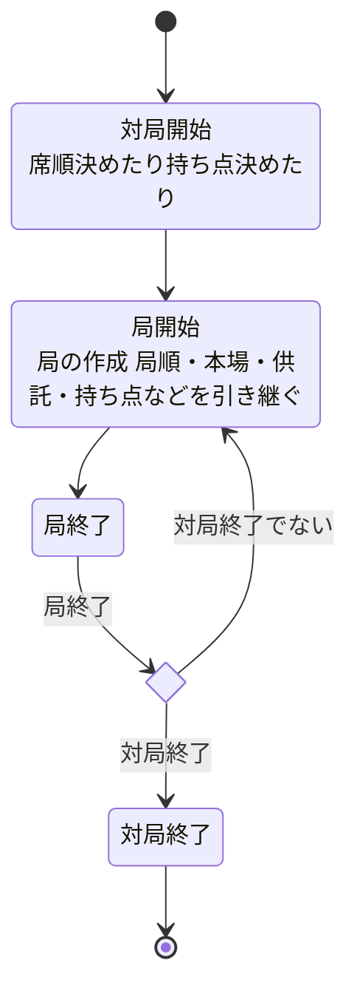
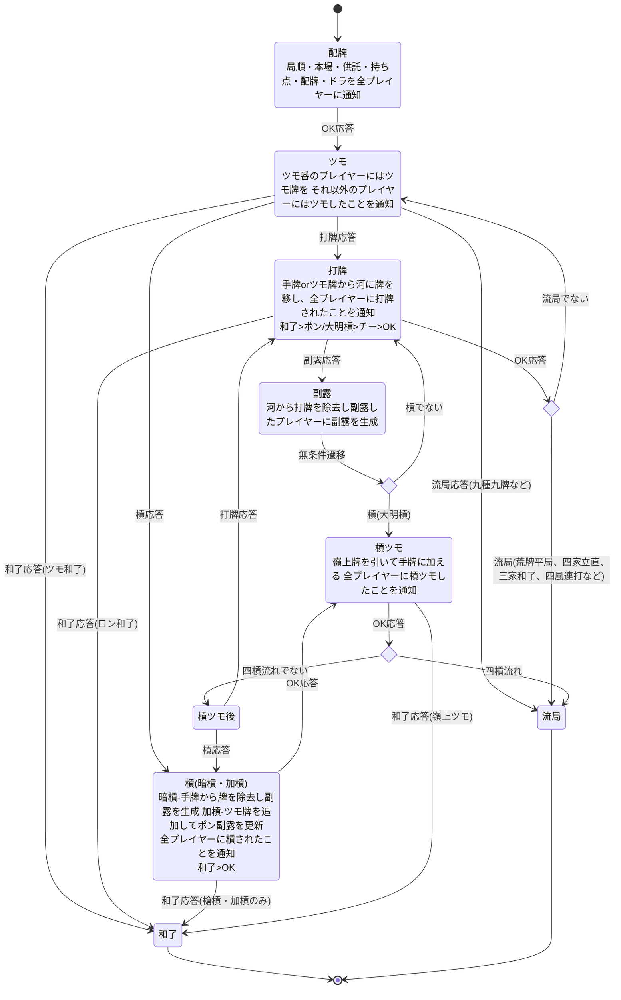

# 設計

## 牌

- 牌は牌(Tile)と牌種別(TileKind)に分ける
- 牌種別は牌の絵柄を表現する
  - 点数計算には牌の絵柄のみが必要なので
- 牌は同じ絵柄でも牌1枚1枚を区別して表現する
  - 実際のゲームでは牌を区別する必要があるので
- 赤ドラはルールによって異なるため、局ごとに管理し点数計算モジュールや表示モジュールに通知する

## 副露種類

- ポン
- チー
- 暗槓
- 大明槓
- 加槓
- 点数計算において大明槓と加槓には差がないため明槓にまとめる
- 対局において大明槓と加槓は表示上の違いがあるため区別する

## 点数計算

- 役と点数は天鳳準拠
- ルールは天鳳準拠だがローカルルールも多少込み

## 対局の状態遷移

## 局の状態遷移

- プレイヤーに通知後、全プレイヤーの応答を待つ
- 副露のチー・ポン・大明槓のそれぞれの処理はCallで行う
- 立直は打牌と統合する
  - 立直打牌に対して和了応答があった場合は供託しない
  - 立直打牌に対して和了応答がなかった場合は供託後、打牌に対する応答の処理を行う
- チーとポン/大明槓が同時にあった場合はポン/大明槓が優先
- 副露とロンが同時に合った場合はロンが優先
- ダブロン、トリプルロンはルールによる(天鳳ではダブロンあり、三家和了は途中流局。天鳳以外のルールへの対応も視野に入れている)
- 同時副露や同時ロンは図に書くと複雑すぎるので省略 集約したのち優先順位に従って遷移させる実装を行う
- 槓など複数のイベントでの遷移先があるものも同様に集約後優先順位に従って遷移させる実装を行う
- 槓ドラ表示タイミング: 天鳳では暗槓は即乗り、明槓/加槓は後めくり(打牌または続く嶺上の直前)
- 四槓流れは槓ツモ後和了でない場合に判定が行われる
- 抜きは一旦考えないが、点数計算ライブラリではあらかじめ考慮しておく

## 要素

対局に出てくる要素は以下

- プレイヤー
- 親
- 持ち点
- 山
  - ドラ表示牌
  - 裏ドラ表示牌
  - 嶺上牌
- 河
- 手牌・副露
- 局順 東一局とか
- 本場
- 供託(リーチ棒)
- ツモ番
- ルール
  - 赤が何枚かなども
